Exercise 1
================

**Intro to Predictive Modeling Exercise 1- Anuraag Mohile**
===========================================================

Probability Practice
--------------------

### Part A.

Let Y-&gt;Yes, T-&gt;Truthful Clicker, R-&gt;Random Clicker

P(T)= 0.7, P(R)=0.3, P(Y|R)=0.5, P(Y)=0.65

According to the rule of total probability,

P(Y)=P(Y|T).P(T) + P(Y|R).P(R)

0.65=P(Y|T).0.7 + 0.5.0.3

P(Y|T)=5/7

### Part B.

Let, A-&gt; Test is positive, B-&gt; Has disease

P(A|B)=0.993

P(not A| not B)=0.9999 &lt;=&gt; P(A|not B)=0.0001

P(B)=0.000025 &lt;=&gt; P(not B)=0.999975

According to the rule of total probability,

P(A)=P(A|B).P(B) + P(A|not B).P(not B)

P(A)=0.993.0.000025 + 0.0001.0.999975

P(A)=0.000124822

According to Baye's Theorem,

P(B|A)=P(A|B).P(B)/P(A)

P(B|A)=0.993.0.000025/0.000124822

P(B|A)=0.19888 ~ 20%

Thus, the test would be wrong 80% of the time when the result is positive.

Exploratory analysis: green buildings
-------------------------------------

Let us first split the dataset into subsets of green-rated and not green-rated

Now, let's see the ages for each

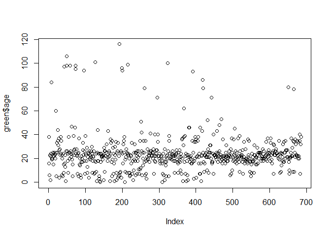

Median age for green-rated buildings:

    [1] 22

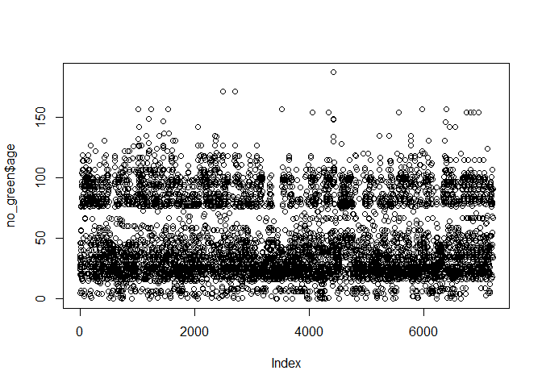

Median age for normal buildings:

    [1] 37

We see that green-rated buildings tend to be newer. Now, let's see the relationship between age and rent 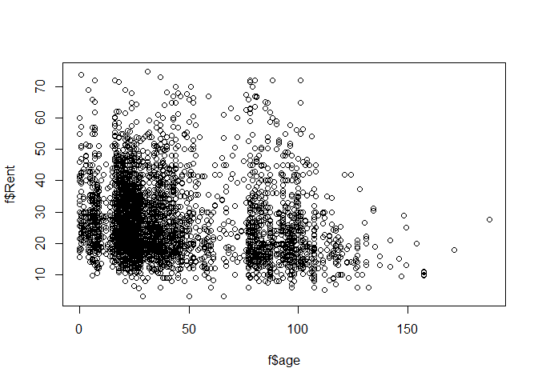

We see that newer buildings tend to have higher rents. Exploring this further:

Median rent for houses below 30 years old:

    [1] 27

Median rent for houses above 30 years old:

    [1] 24

Thus, the difference in rents that the Excel guru got, could be explained by the age of the buildings, among other "behind-the-scenes" variables. The "stats guru"" forgot that correlation doesn't mean causation. We need to look at more variables which could be correlated with green-rating, and could be responsible for the rent difference, before drawing conclusions about whether building a green-rated building is viable or not. If other variables are controlled, we can get a clearer idea on that matter.

**Bootstrapping**
-----------------

### One Asset at a time

#### Only TLT in portfolio

Total wealth if only TLT in portfolio

    [1] 100503.4

5% VAR if only TLT in portfolio

           5% 
    -6022.097 

#### Only SPY in portfolio

Total wealth if only SPY in portfolio

    [1] 100824.5

5% VAR if only SPY in portfolio

           5% 
    -8252.674 

#### Only LQD in portfolio

Total wealth if only LQD in portfolio

    [1] 100410.2

5% VAR if only LQD in portfolio

           5% 
    -3053.599 

#### Only EEM in portfolio

Total wealth if only EEM in portfolio

    [1] 102367.9

5% VAR if only EEM in portfolio

           5% 
    -13163.27 

#### Only VNQ in portfolio

Total wealth if only VNQ in portfolio

    [1] 100844.3

5% VAR if only VNQ in portfolio

           5% 
    -13812.72 

We see that LQD has lowest risk but also gives lowest profit; TLT has double the risk but not much more profit than LQD; SPY is riskier than both of them, but has higher profits; EEM has considerably higher profits and not too high a risk considering the profits, but it is higher than even SPY; VNQ seems to be the worst since, the profit is only marginally higher than SPY but risk is almost double, and highest out of the lot.

### *Even Split Portfolio*

    [1] "TLT" "LQD" "SPY" "VNQ" "EEM"

Correlation matrix for the 5 assets

               ClCl.TLTa  ClCl.LQDa  ClCl.SPYa   ClCl.VNQa   ClCl.EEMa
    ClCl.TLTa  1.0000000 0.43237319 -0.4362148 -0.25332123 -0.16758098
    ClCl.LQDa  0.4323732 1.00000000  0.1013347  0.07156075  0.08784764
    ClCl.SPYa -0.4362148 0.10133468  1.0000000  0.76813129  0.40676425
    ClCl.VNQa -0.2533212 0.07156075  0.7681313  1.00000000  0.29228612
    ClCl.EEMa -0.1675810 0.08784764  0.4067643  0.29228612  1.00000000

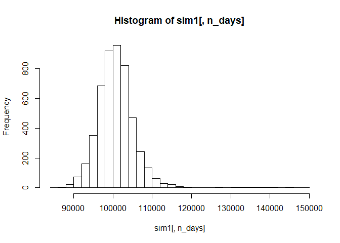

Total wealth for even split portfolio

    [1] 100990.3

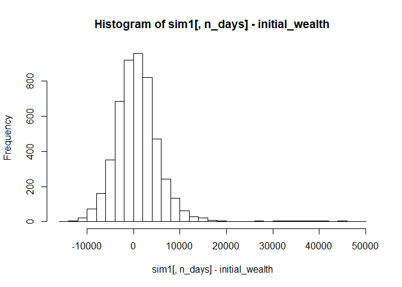

5% VAR for even split portfolio

           5% 
    -6058.288 

### *Safer Portfolio*

To make a safer portfolio, we need to consider the assets with lower risks. Also, at least 2 assets need to be negatively correlated since, if one of them goes down, the other one shouldn't go down too because of it. Keeping this in mind, we see that LQD, TLT, and SPY seem to be the best. They have the lowest risks out of the 5. Also, TLT and SPY are negatively correlated. Allocations: 50% for LQD, 30% for SPY, 20% for TLT 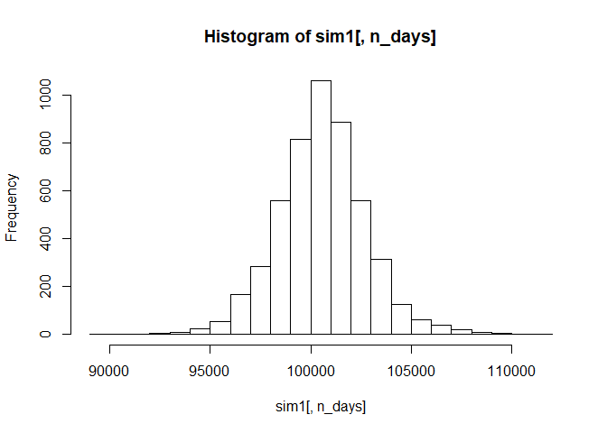

Total wealth for safer portfolio

    [1] 100553.3

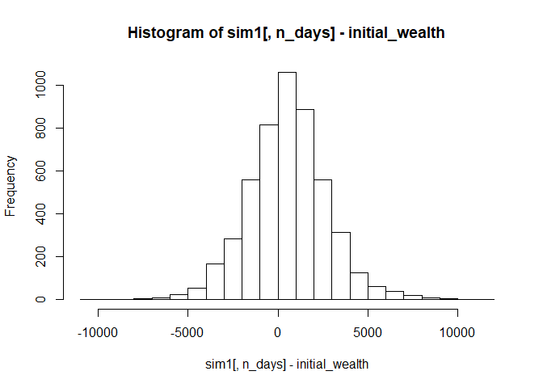

5% VAR for safer portfolio

           5% 
    -3070.781 

### *Aggressive Portfolio*

EEM has highest profit along with a high risk. It has the best Profit to Risk ratio. So adding another asset which lowers the risk while not decreasing the profit too much is what's required. TLT works best since, it is the only one negatively correlated with EEM. Allocation: 60% to EEM; 40% to TLT 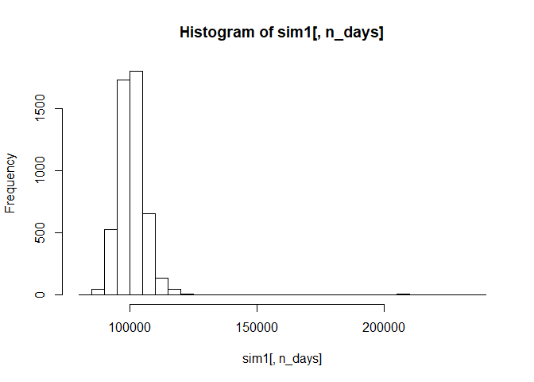

Total wealth for aggressive portfolio

    [1] 101622.5

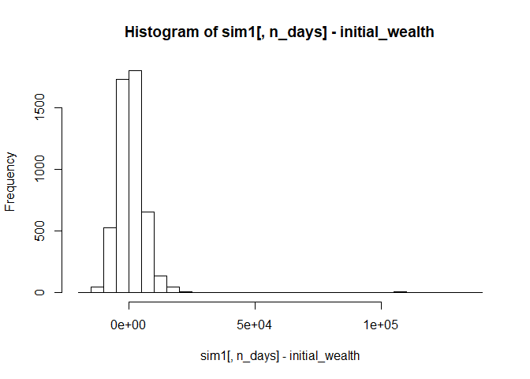

5% VAR for aggressive portfolio

           5% 
    -7012.871 

Market Segmentation
-------------------

Using PCA:

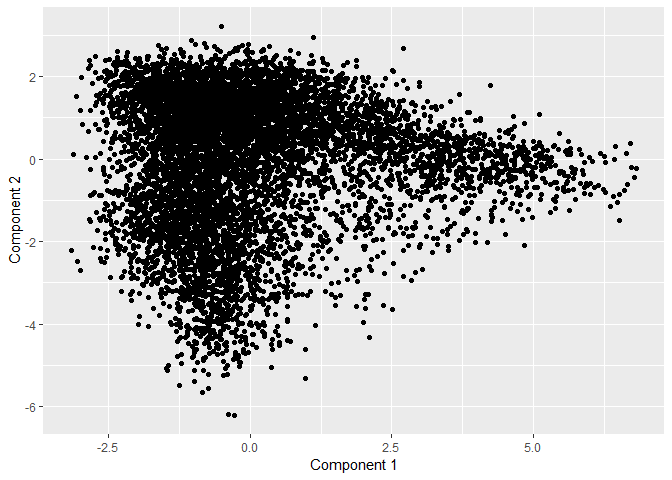

We see that most of the observations are very closely clustered around the top & top-left, while some are clustered near the bottom (Negative of second PC) and others to the right (Positive of first PC)

The top words associated with each component:

PC1: Positive side

    [1] "religion"      "sports_fandom" "parenting"     "food"         
    [5] "school"        "family"       

Negative Side

    [1] "college_uni"   "fashion"       "cooking"       "shopping"     
    [5] "chatter"       "photo_sharing"

PC2: Positive side

    [1] "chatter"        "politics"       "travel"         "shopping"      
    [5] "automotive"     "current_events"

Negative Side

    [1] "beauty"           "fashion"          "cooking"         
    [4] "outdoors"         "personal_fitness" "health_nutrition"

Graph of variables along with their contributions represented by color 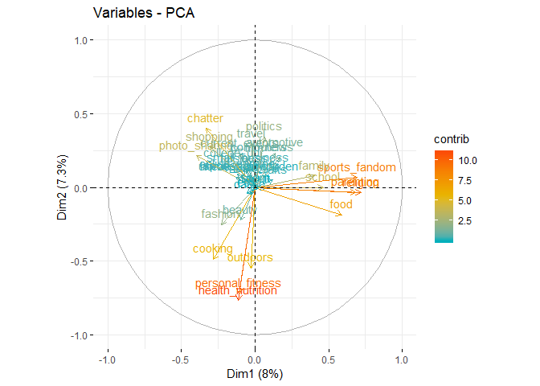

We can see 2 clear clusters-

1)One which includes "family",school","parenting","food","religion", etc. These represent more of 'familial', core values.

2)Second which includes "beauty", "fashion", "personal\_fitness", "health\_nutrition", etc. These are more of self-care related interests.
